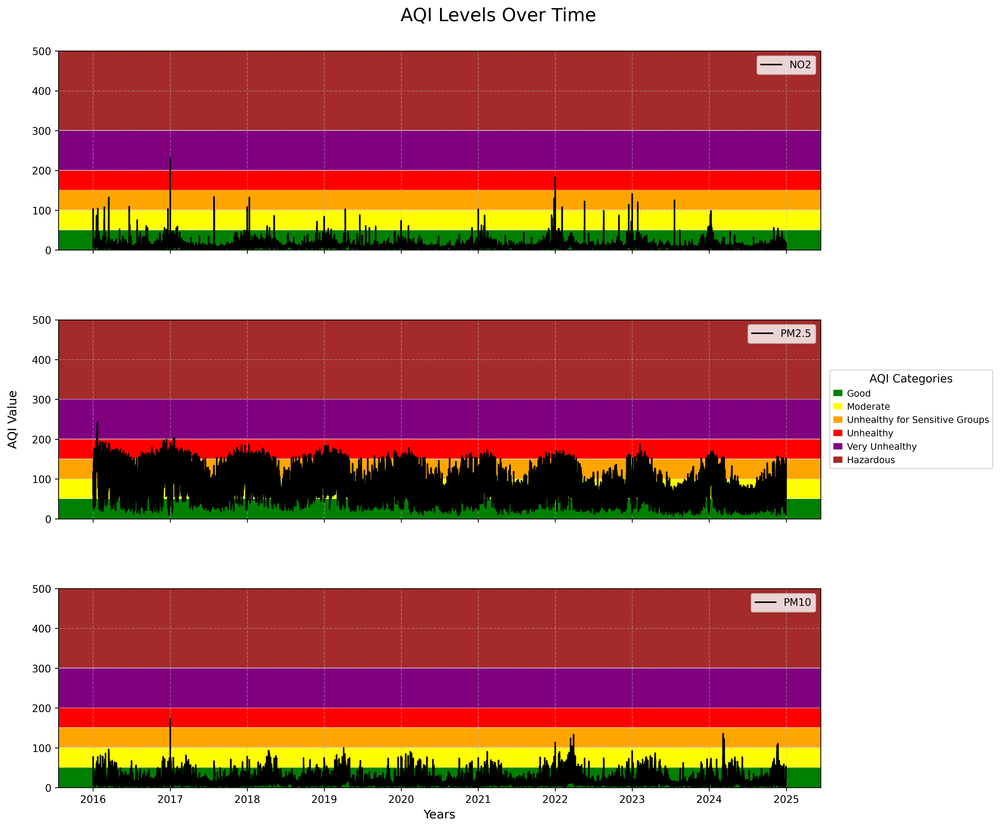

# Oppgave 4 -Dataanalyse

I denne delen av prosjektet skal dere bruke verktøy som NumPy, Pandas, Matplotlib osv. til å beregne statistiske mål som gjennomsnitt, median og standardavvik, som er essensielle for å forstå datakvaliteten og identifisere trender. 
Videre vil dere implementere enkle statistiske analyser for å avdekke mønstre i dataene, noe som kan gi innsikt i miljøforholdene over tid. 
Denne analysen vil danne grunnlaget for videre visualisering og prediktiv analyse, og bidra til en dypere forståelse av de miljømessige faktorene som påvirker samfunnet.

*Vurderingskriterier:*

1. Hvordan kan du bruke NumPy og Pandas til å beregne gjennomsnitt, median og standardavvik for de innsamlede dataene, og hvorfor er disse statistiske målene viktige?
2. Kan du gi et eksempel på hvordan du vil implementere en enkel statistisk analyse for å undersøke sammenhengen mellom to variabler i datasettet?
3. Hvordan planlegger du å håndtere eventuelle skjevheter i dataene under analysen, og hvilke metoder vil du bruke for å sikre at analysen er pålitelig?
4. Hvilke visualiseringer vil du lage for å støtte analysen din, og hvordan vil disse visualiseringene hjelpe deg med å formidle funnene dine?

## Kode funksjon

Denne oppgaven er løst i scriptet Dataanalyse.py. Dataen som er analysert er den manipulerte Air Pollutants dataen lagret i mean_air_pollutants.pkl fra oppgave 3 (Databehandling.py).
For å holde koden mest mulig lesbar har alle nødvendige funksjoner for denne oppgaven blitt lagt i scr/Functions_Dataanalysis. 
Følgende relevante funksjoner for er hentet ut:

1. cap_outliers
2. plot_histogram
3. mean_std_meadin_corr
4. reggresion_analysis

### 1. cap_outliars
I oppgave 3 ble dataen for NO2, PM25 og PM10 hentet inn og filtrert for blandt annet nan verdier og negative verdier. I denne oppgaven blir også "uteliggere" identifisert.
For å undersøke spredningen i de tre datasettene ble det i første omgang plottet et boxplot (med seaborn miljøet) for å få oversikt over hvilke verdier som var "typiske"
for datasettet. Det ble oppdaget at alle tre datasettene hadde ett sett med uteliggere. Uteliggere er i seaborn.boxplot definert som data som ligger utenfor "Whiskers", der Whiskers er
(om ikke annet spesifisert i funksjonskallet) første og tredje kvartil +- 1.5*IQR. Avstanden mellom Whiskers linjene rommer med andre ord 75% av daten.

For å håndtere disse uteliggerene kom gruppen fram til at beste metoden ville være å sette alle uteliggerene lik den Whiskers verdien som dataen lå utenfor. Det ble vurdert å bare direkte fjerne uteliggerene direkte,
men dette ville ha medført error i datalengde når dataen skal brukes for videre analyse. Uteliggerene ble identifisert og erstattet med whiskers verdien ved å bruke pandas sin innebygde funksjon .clip(lower,upper).
Lower og Upper ble satt til whiskers grensene, som er regnet ut ved ligningene:

    - Upper = Q3 + 1.5 * IQR 
    - Lower = Q1 - 1.5 * IQR

Første og tredje kvartil (Q1 og Q3) ble regner ut med pandas sin innebygde funksjon .quantiles(). 
Numpy har også en funksjon for å regne ut kvantiler, men denne tar inn serier av typen ndarray. Siden cap_outliars() tar inn en dict med dataframes for analyse,
passet pandas sin .quantiles() best. For å illustrere at uteliggerene faktisk har blitt fjernet ble seaborn.boxplot() brukt på datasettet før uteliggerene ble fjernet, og etter uteliggerene ble fjernet.
Datasettet uten uteliggere er det som blir videre analysert i respen av oppgave 4, samt oppgave 5 og 6.

### 2. plot_histogram

For å visualisere frekvensfordelingen av de ulike målte luftkvalitet verdiene i datasettene NO2, PM25 og PM10
ble seaborn sin histogram funksjon (seaborn.histplot()) brukt. Datamålingene ble fordelt i 20 bins, da gruppen vurderte dette som en god nok illustrering av frekvensfordelingen.
Histogrammene til de ulike luft kvalitet målingene skal ha lik farge som ble brukt i boxplottet respektivt.

### 3. mean_std_meadin_corr

Denne funksjonen samler beregninger for gjennomsnitt, standardavvik, median og Pearsons korrelasjonsfaktor på ett sted.
Både numpy og pandas har innebygde funksjoner for å regne ut disse statistiske verdiene. Igjen ble pandas miljøet brukt da dataen som er analysert i oppgaven er formatert som et pandas DataFrame.

1. df.mean(): Brukt for å regne ut gjennomsnittet av luftkvalitets utslippene. Gir en enkel oppsummering av datasettet. Passer best for symmetrisk fordelt data.
2. df.median(): Brukt for å regne ut medianen. Gir en bedre oppsummering av datasettet enn gjennomsnittsverdien dersom dataen ikke er symmetrisk men heller skjevfordelt. Fra histogrammet som ble plottet ser en at data fordelingen ikke er helt symmetrisk, og medianen kan derfor oppsummere dataen bedre enn gjennomsnittet.
3. df.std(): Brukt for å regne ut standardavviket. Standardavviket passer som gjennomsnittet best for normalfordelt data, og sier noe om spredningen til dataen. Dersom dataen er normalfordelt vill standardavviket representere 84% av dataen over og under gjennomsnittet. 
4. df.corr(): Brukt for å regne ut Pearsons korrelasjonsfaktor mellom år og utslippsmåling av NO2, PM2.5 og PM10. Pearsons korrelasjonsfaktor sier noe om den linære sammenhengen mellom to variabler. I dette tilfellet vil en positiv korrelasjonsfaktor indikere at luftkvaliteten blir dårligere over tid (høyre målinger) og omvendt. Korrelasjonsfaktor på null eller nærme null indikerer ingen stor linær korrelasjon.  

### 4. reggression_analysis
Denne funksjonen undersøker både årlige trender, men også sesongbaserte trender gjennom hvert år. I denne analysen brukes STL miljøet, som tar hensyn til ikke-linære trender.
Funksjonen henter inn dataframene (uten uteliggere) og setter dato-tid som index. For å kunne analysere sesongbaserte trender blir månedlig median videre regnet ut ved å bruke pandas sin .resample('MS') og .median(). Funksjonen .resample('MS') ble brukt for å lage grupper, som her er alle verdiene tilhørende hver måned i året. 'MS' betyr at gruppen måles fra første klokketime den måneden til siste klokketime den måneden.
Siden det fra histogram-plottingen og statistikk analysen ble tydelig at dataen ikke er normalfordelt men heller vesntrefordelt, ble det tatt medianen av hver måned istede for gjennomsnittet.

Videre brukes STL (Season(al) trends decomposition using LOESS) miljøet til å analysere variasjonene i datasettet.
STL() funksjonen henter da inn den månetlige median dataen for hver måned hvert år, samt parameterene period og seasonal. Gruppen kom fram til at å sette period=12 ville være et godt valg da det forteller funksjonen STL()
at en periode (ett år) gjentar seg hver 12 gruppe (måned). I følge (https://www.statsmodels.org/dev/examples/notebooks/generated/stl_decomposition.html) bør en trend være ca 150% av seasonal parameteren og være oddetall. Trend ble derfor satt til 19 (12*1.5 + 1 = 19).
Funksjonen .fit() finner både seasonal, trend og resid:

1. .trend i dette tilfellet forteller den hvordan den langsiktige variasjonen ser ut.
2. .seasonal beskriver den årlige syklusen, som her blir variasjonen fra måned til måned.
3. .resid beskriver på et vis uteliggerene av dataen, eller den delen av dataen som ikke kan forklares med en spesifikk trend.

## Analyse funn

