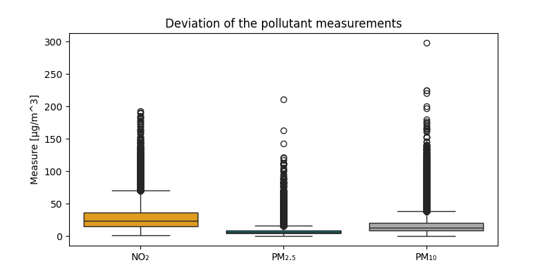
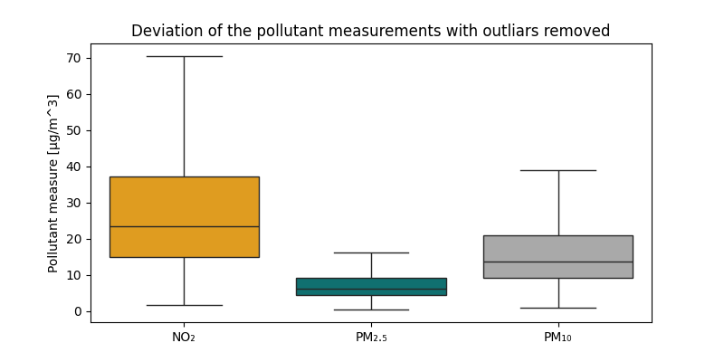
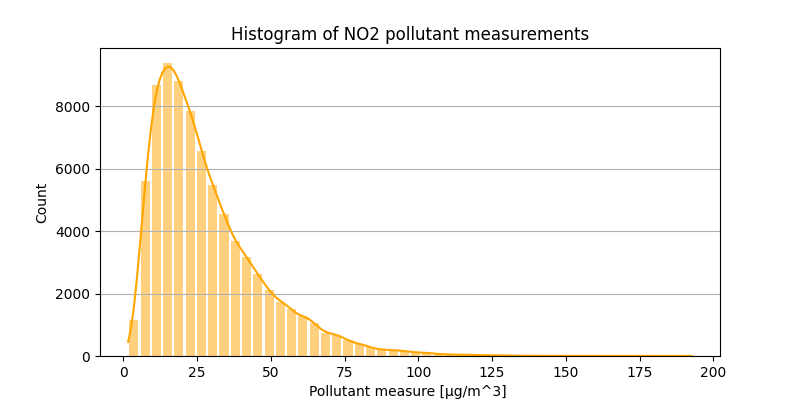
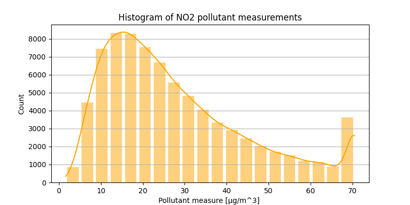
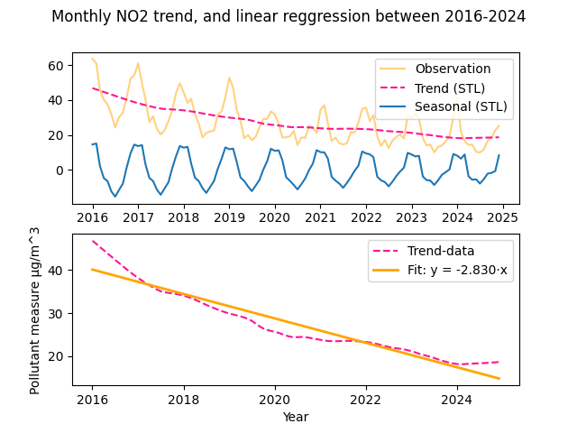

# Oppgave 4 -Dataanalyse

## Kode funksjon

Denne oppgaven er løst i scriptet Dataanalyse.py. Dataen som er analysert er den manipulerte Air Pollutants dataen lagret i mean_air_pollutants.pkl fra oppgave 3 (Databehandling.py).
For å holde koden mest mulig lesbar har alle nødvendige funksjoner for denne oppgaven blitt lagt i scr/Functions_Dataanalysis. 
Følgende relevante funksjoner for er hentet ut:

1. cap_outliers
2. plot_histogram
3. mean_std_meadin_corr
4. reggresion_analysis

### 1. cap_outliars
I oppgave 3 ble dataen for NO2, PM25 og PM10 hentet inn og filtrert for blandt annet nan verdier og negative verdier. I denne oppgaven blir også "uteliggere" identifisert.
For å undersøke spredningen i de tre datasettene ble det i første omgang plottet et boxplot (med seaborn miljøet) for å få oversikt over hvilke verdier som var "typiske"
for datasettet. Det ble oppdaget at alle tre datasettene hadde ett sett med uteliggere. Uteliggere er i seaborn.boxplot definert som data som ligger utenfor "Whiskers", der Whiskers er
(om ikke annet spesifisert i funksjonskallet) første og tredje kvartil +- 1.5*IQR. Avstanden mellom Whiskers linjene rommer med andre ord 75% av daten.

For å håndtere disse uteliggerene kom gruppen fram til at beste metoden ville være å sette alle uteliggerene lik den Whiskers verdien som dataen lå utenfor. Det ble vurdert å bare direkte fjerne uteliggerene direkte,
men dette ville ha medført error i datalengde når dataen skal brukes for videre analyse. Uteliggerene ble identifisert og erstattet med whiskers verdien ved å bruke pandas sin innebygde funksjon .clip(lower,upper).
Lower og Upper ble satt til whiskers grensene, som er regnet ut ved ligningene:

    - Upper = Q3 + 1.5 * IQR 
    - Lower = Q1 - 1.5 * IQR

Første og tredje kvartil (Q1 og Q3) ble regner ut med pandas sin innebygde funksjon .quantiles(). 
Numpy har også en funksjon for å regne ut kvantiler, men denne tar inn serier av typen ndarray. Siden cap_outliars() tar inn en dict med dataframes for analyse,
passet pandas sin .quantiles() best. For å illustrere at uteliggerene faktisk har blitt fjernet ble seaborn.boxplot() brukt på datasettet før uteliggerene ble fjernet, og etter uteliggerene ble fjernet.
Datasettet uten uteliggere er det som blir videre analysert i respen av oppgave 4, samt oppgave 5 og 6.

### 2. plot_histogram

For å visualisere frekvensfordelingen av de ulike målte luftkvalitet verdiene i datasettene NO2, PM25 og PM10
ble seaborn sin histogram funksjon (seaborn.histplot()) brukt. 
Histogrammene til de ulike luft kvalitet målingene skal ha lik farge som ble brukt i boxplottet respektivt.

### 3. mean_std_meadin_corr

Denne funksjonen samler beregninger for gjennomsnitt, standardavvik, median og Pearsons korrelasjonsfaktor på ett sted.
Både numpy og pandas har innebygde funksjoner for å regne ut disse statistiske verdiene. Igjen ble pandas miljøet brukt da dataen som er analysert i oppgaven er formatert som et pandas DataFrame.

1. df.mean(): Brukt for å regne ut gjennomsnittet av luftkvalitets utslippene. Gir en enkel oppsummering av datasettet. Passer best for symmetrisk fordelt data.
2. df.median(): Brukt for å regne ut medianen. Gir en bedre oppsummering av datasettet enn gjennomsnittsverdien dersom dataen ikke er symmetrisk men heller skjevfordelt. Fra histogrammet som ble plottet ser en at data fordelingen ikke er helt symmetrisk, og medianen kan derfor oppsummere dataen bedre enn gjennomsnittet.
3. df.std(): Brukt for å regne ut standardavviket. Standardavviket passer som gjennomsnittet best for normalfordelt data, og sier noe om spredningen til dataen. Dersom dataen er normalfordelt vill standardavviket representere 84% av dataen over og under gjennomsnittet. 
4. df.corr(): Brukt for å regne ut Pearsons korrelasjonsfaktor mellom år og utslippsmåling av NO2, PM2.5 og PM10. Pearsons korrelasjonsfaktor sier noe om den linære sammenhengen mellom to variabler. I dette tilfellet vil en positiv korrelasjonsfaktor indikere at luftkvaliteten blir dårligere over tid (høyre målinger) og omvendt. Korrelasjonsfaktor på null eller nærme null indikerer ingen stor linær korrelasjon.  

### 4. reggression_analysis
Denne funksjonen undersøker både årlige trender, men også sesongbaserte trender gjennom hvert år. I denne analysen brukes STL miljøet, som tar hensyn til ikke-linære trender.
Funksjonen henter inn dataframene (uten uteliggere) og setter dato-tid som index. For å kunne analysere sesongbaserte trender blir månedlig median videre regnet ut ved å bruke pandas sin .resample('MS') og .median(). Funksjonen .resample('MS') ble brukt for å lage grupper, som her er alle verdiene tilhørende hver måned i året. 'MS' betyr at gruppen måles fra første klokketime den måneden til siste klokketime den måneden.
Siden det fra histogram-plottingen og statistikk analysen ble tydelig at dataen ikke er normalfordelt men heller vesntrefordelt, ble det tatt medianen av hver måned istede for gjennomsnittet.

Videre brukes STL (Season(al) trends decomposition using LOESS) miljøet til å analysere variasjonene i datasettet.
STL() funksjonen henter da inn den månetlige median dataen for hver måned hvert år, samt parameterene period og seasonal. Gruppen kom fram til at å sette period=12 ville være et godt valg da det forteller funksjonen STL()
at en periode (ett år) gjentar seg hver 12 gruppe (måned). I følge (https://www.statsmodels.org/dev/examples/notebooks/generated/stl_decomposition.html) bør en trend være ca 150% av seasonal parameteren og være oddetall. Trend ble derfor satt til 19 (12*1.5 + 1 = 19).
Funksjonen .fit() finner både seasonal, trend og resid:

1. .trend i dette tilfellet forteller den hvordan den langsiktige variasjonen ser ut.
2. .seasonal beskriver den årlige syklusen, som her blir variasjonen fra måned til måned.
3. .resid beskriver på et vis uteliggerene av dataen, eller den delen av dataen som ikke kan forklares med en spesifikk trend.

Videre ble det gjort en reggresjonsanalyse ved å bruke .polyfit() funksjonen fra numpy miljøet.

## Analyse funn

### 1. Uteliggere
Figuren under viser en visualisering av dataspredningen for de ulike utslippene, samt uteliggere i datasettene. Ved første øyekast ser en at alle tre datasettene innholder store mengder med uteliggere. Det er vanskelig å si noe om hvor sannsynlige disse uteliggerene er, altså om det faktisk er feilmålinger eller om det bare er uvanlige funn.
I følge (https://swachhindia.ndtv.com/air-pollution-what-is-air-quality-index-how-is-it-measured-and-its-health-impact-40387/) er en PM10 måling på 300 rangert som "Poor", en PM2.5 måling på 225 som "Very Poor" og en NO2 måling på 200 rangert som "Poor". Altså er ikke uteliggerene helt usannsynlige, men heller sjeldne målinger.
Å klippe vekk uteliggerene til senere analyser i oppgave 5 og 6 som først tenkt er derfor kanskje ikke den beste avgjørelsen, men for denne oppgaven kan det å klippe vekk uteliggerene utelate være lurt for å få en best mulig indikasjon på trender og utelate "støy".

Figuren under viser dataspredningen når uteliggerene er fjernet og erstattet med whiskers grensene:

### 2. Frekvensfordeling av data (histogram)
Histogram plotting ble gjort for datasettet både med og uten uteliggerene for å vurdere om hvilket datasett som skal brukes videre for analyser i prosjektet.
Figuren under viser histogrammet for datasettet med uteliggere for NO2. For NO2 ser vi fra boxplottet i forrige deloppgave at uteliggerene forekommer etter øvre whiskers som er på rundt 70 µg/m^3.
Histogrammet illustrerer tydligere frekvensen av forekomstem for disse uteliggerene, som er ganske lav. Det vurderes derfor at videre for trend analyser brukes datasettet der uteliggerene er klippet bort.

Figuren under viser histogrammet for datasettet etter uteliggerene er fjernet og erstattet med whiskersene.
Plottet illustreret godt hvordan datasettet ikke er normalfordelt, men heller venstrefordelt (nærmest første kvartil).
Utifra figuren ser en også at det å sette uteliggerene til whiskersgrensene ikke var den beste løsningen, og blir notert for videre forbedringer til utviklere.

### 3. Statistisk oppsummering av dataen

Slik som nevnt og illustrert i forrige deloppgave ser det ut til at datasettet er venstrefordelt og ikke normalfordelt. Dette bekreftes også av å kjøre mean_std_meadin_corr(),
da outputtet forteller at gjennomsnittsverdien og medianen er ulik for alle tre datasettene. En kan bekrefte venstrefordelingen illustrert i histogrammet ved å se at medianen ligger nærmere første kvartil for alle datasettene.
Da standardavviket gir best beskrivelse av spredningen dersom datasettet er normalfordelt, er ikke standardavviket funnet i dette tilfellet den beste beskrivelsen på spredningen av dataen. Første og tredje kvartil beskriver her bedre hva spredningen av dataene for de ulike utslippene er.

Videre gir alle korrelasjonsfaktorene en lavere absolutt verdi enn 0.6. I følge __ er en robust korrelasjonsfaktor ofte større enn 0.6. Likevel kan dette varriere fra type data en ser på.
NO2 får en korrelasjonsfaktor mellom tid og utslipp på -0.4, som vil si at det er en moderat sammenheng mellom dataene. Altså kan omtrent 16% av den linære nedgangen i NO2 målinger ses i sammenheng med tiden.
De to andre målingene har en svært lav korrelasjonsfaktor (nærme 0), og det blir vanskelig å skulle trekke en direkte linær sammenheng mellom tiden og nedgangen i utslippsmåling.

### 4. STL og reggresjonsanalyse

STL analysen fra denne oppgaven viste i seasonal grafen en tydelig sesongbasert trend fra måned til måned for de ulike utslippsdataene NO2,PM2.5 og PM10.
Figuren under viser eksempelvis plottet av STL analysen for NO2 dataen, samt plottet for den linære reggresjonsanalysen sammenlignet med trend-dataen.
Utifra sen sesongbaserte trenden (den blå grafen) vurderte gruppen at det kan være interessant i oppgave 5 å se om en finner en sammenheng mellom temperatur og utslippsnivå dat det ser ut til at peaken på utslipp topper seg i vintermånedene for alle årene.

NO2 viste seg å ha en mer synkende trend fra år til år enn de to andre (PM10 og PM2.5). 
I følge FHI er den største årsaken til foreomsten av NO2 vegtrafikk med disel og bensin biler(https://www.fhi.no/kl/luftforurensninger/luftkvalitet/temakapitler/nitrogendioksid2/?term=#kilder-og-luftforurensningsniver-av-nitrogendioksid).
Denne sammenhengen vil derfor bli videre undersøkt i oppgave 5.

Også er trenden for PM2.5 synkende over tid, men i lavere grad enn NO2. PM10 derimot har en svak vekst i utslipp, men da denne trenden har en linær økning på omtrent 1.45% per år er dette såpass lavt at gruppen konkluderer med at datasettet burde inkludert flere år for å kunne si noe sikkert om trenden faktisk er voksende.
En linær trend fra år til år for verken PM2.5 eller PM10 kan ikke konkluderes med utifra denne analysen, da trend-dataen fra STL analysen er også ganske flukterende sammenlignet med NO2.

